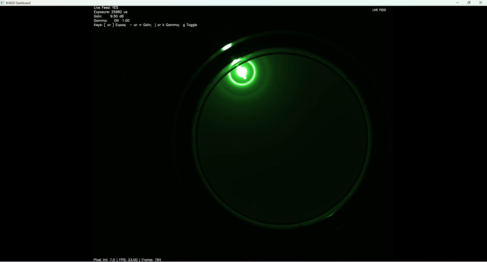
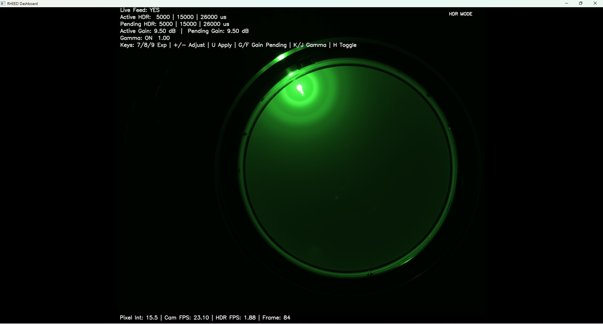

# 📡 RHEED-ML-Pipeline

## Real-Time RHEED Acquisition, ROI Analytics, HDR Imaging, and Offline ML Processing

**RHEED-ML-Pipeline** is a real-time experimental imaging framework for **RHEED (Reflection High-Energy Electron Diffraction)** data acquisition, interactive ROI-based signal tracking, HDR live fusion, structured recording, and offline machine learning analysis.

This repository is designed for researchers who need a practical workflow for:

* live RHEED monitoring during growth
* interactive signal extraction from diffraction regions
* synchronized video + ROI logging
* HDR-style live visualization from multi-exposure fusion
* offline dimensionality reduction and clustering of recorded data

It supports both:

* **FLIR Blackfly cameras** through **Spinnaker SDK + PySpin**
* **Dummy video playback mode** for development and testing without hardware

---

## 🧭 Project Purpose

The goal of this project is to provide a single research-ready pipeline for **live RHEED observation and downstream analysis**.

At a high level, the codebase enables:

* **live camera acquisition**
* **interactive ROI creation and tracking**
* **line-profile extraction**
* **structured CSV logging of ROI measurements**
* **recording of raw and colorized videos**
* **HDR live feed generation** using multiple exposure captures
* **offline ML analysis** using preprocessing, PCA, and K-Means

This makes the repository useful for:

* thin-film growth monitoring
* diffraction feature tracking
* time-dependent intensity analysis
* exploratory pattern evolution analysis
* building future ML-driven growth diagnostics

---

## ✨ Main Capabilities

### Live acquisition and visualization

* real-time camera feed from a FLIR Blackfly camera
* fallback to dummy camera when hardware is unavailable
* threaded architecture for smoother live operation
* live gradient color mapping using `rheed_gradient_lut.npy`

### Interactive ROI analytics

* draw up to **6 ROIs**
* ellipse and rectangle ROI modes
* move, resize, delete, and reset ROIs interactively
* live ROI intensity tracking
* hover tooltip showing ROI summed intensity
* separate ROI monitor popout with time-series plots

### Line profile analysis

* draw a line across diffraction features
* live 1D intensity profile extraction
* dedicated line profile popout window
* min intensity, elapsed time, and pixel-position display

### Structured logging and recording

* ROI CSV logging with timestamps and geometry metadata
* raw grayscale recording
* colorized recording
* automatic date-based output folders

### HDR live mode

* locked HDR acquisition pipeline in `hdr_rheed_base.py`
* 3-exposure fusion using `cv2.createMergeMertens`
* adjustable pending HDR exposure triplet
* adjustable pending HDR gain
* temporal smoothing to suppress visible strobing
* one-click saving of a representative exposure triplet

### Offline machine learning workflow

* video inspection and crop suggestion
* preprocessing pipeline
* PCA decomposition
* K-Means clustering
* publication-ready plots


---

## 🖼 Example Dashboards and Analysis Views

### Standard Live Feed (`main.py`)
Real-time RHEED dashboard for standard acquisition with exposure, gain, and gamma control, live FPS display, recording support, and structured ROI logging.



### HDR Live Feed (`hdr_rheed_base.py`)
HDR dashboard showing fused multi-exposure live visualization with active/pending HDR exposure controls, pending gain control, gamma control, and HDR FPS reporting.



### ROI + Line Overlay View
Example of multiple user-defined ROIs and a live line profile selection drawn directly on the feed for simultaneous region tracking and line-based intensity extraction.


### Line Profile Window
Dedicated line-profile analysis window showing intensity variation along the selected line, including axis labels, grid, elapsed time, and minimum intensity summary.


### ROI Monitor Window
Popout ROI monitor displaying time-series intensity trends for up to six ROIs, with per-ROI elapsed time, min/max statistics, and hover inspection.


---

## 🏗 Current Project Structure
---text
RHEEDVideo/
│
├── main.py
├── hdr_rheed_base.py
├── camera.py
├── dummy_camera.py
├── roi_manager.py
├── config.py
├── check_pyspin.py
├── check_hdr_camera_capability.py
├── check_camera.py
├── test_camera.py
├── requirements.txt
├── INSTALL.md
├── README.md
├── rheed_gradient_lut.npy
├── RHEED_RUN.cmd.bat
│
├── ML/
│   ├── inspect_rheed_video.py
│   ├── pre_processing.py
│   ├── pca.py
│   ├── k_means.py
│   ├── plot_pca.py
│   ├── plot_kmeans.py
│   ├── run_full.py
│   └── inspect_debug/
│
├── captures/
├── hdr_exposure_triplet/
├── results/
├── rheed_videos/
├── roi_data/
├── third_party/
└── venv/
---text

# Core Runtime Scripts

## `main.py` — Real-Time Live Feed Dashboard

`main.py` is the primary live acquisition script for standard RHEED monitoring.

It provides:

* live camera or dummy feed display
* software gradient rendering
* ROI drawing and tracking
* line profile extraction
* ROI monitor popout
* ROI CSV logging
* raw and color video recording
* camera exposure, gain, and gamma controls
* threaded acquisition and processing pipeline

### What `main.py` is intended for

Use `main.py` when you want a **stable real-time live feed** for general RHEED monitoring, signal inspection, ROI-based measurement, and raw/color recording.

### Internal design

`main.py` uses a threaded architecture:

* **Capture thread**

  * acquires frames from camera/dummy source
  * measures live acquisition FPS
  * pushes frames into a queue

* **Processing thread**

  * converts to grayscale if needed
  * updates ROI intensities
  * extracts line profile data
  * writes ROI log rows
  * prepares display frame
  * writes raw and color videos during recording

* **Main/UI thread**

  * renders the dashboard
  * handles mouse and keyboard interaction
  * manages popout windows

### Important behavior in `main.py`

* if a Blackfly camera is not available, the code automatically falls back to `DummyCamera`
* recording writes:

  * **raw grayscale AVI**
  * **colorized AVI**
* ROI measurements are logged continuously to CSV
* hover tooltips show ROI summed intensity
* the ROI monitor window shows up to 6 ROI trend charts

---

## `hdr_rheed_base.py` — HDR Live Dashboard

`hdr_rheed_base.py` is the dedicated HDR version of the dashboard.

This is one of the most important files in the repository. It implements a **locked HDR live pipeline** using a multi-exposure capture cycle and on-the-fly fusion.

### HDR workflow

The script uses:

* `HDR_MODE = True`
* exposure cycle:

  ```python
  [5000.0, 15000.0, 45000.0]
  ```

  though these values can be changed live from the UI
* fixed gain workflow through `GAIN_CONSTANT`
* Mertens exposure fusion via OpenCV
* temporal smoothing to reduce visible strobing artifacts
* queue-based threaded processing similar to `main.py`

### What `hdr_rheed_base.py` achieves

* captures multiple exposure frames in sequence
* fuses them into a single live HDR-like frame
* preserves useful information from both dim and bright regions
* gives researchers a more informative live feed in scenes with strong intensity imbalance
* records fused grayscale and colorized HDR outputs
* saves one representative HDR triplet for debugging and documentation

### Key HDR-specific features

* active vs pending HDR exposure triplet display
* active vs pending HDR gain display
* apply-on-demand behavior using `U`
* HDR FPS reporting
* triplet saving to:

  ```text
  hdr_exposure_triplet/
  hdr_exposure_triplet/raw_sensor/
  ```
* anti-strobing logic:

  * discard frames after exposure changes
  * exposure-compensated fusion inputs
  * temporal smoothing between fused outputs

### What this script is best for

Use `hdr_rheed_base.py` when you need a **higher dynamic range live view** than a single exposure can provide.

This is especially useful when one part of the RHEED scene is very bright while other regions are weak and would otherwise be lost.

---

# Camera Layer

## `camera.py`

`camera.py` is the Blackfly camera wrapper based on **PySpin**.

It handles:

* camera initialization
* nodemap access
* manual exposure control
* manual gain control
* gamma enable / disable
* gamma value control
* stream buffer configuration
* FPS querying
* safe cleanup

### Important implementation details

* forces:

  * `ExposureAuto = Off`
  * `GainAuto = Off`
* configures stream buffering:

  * `StreamBufferHandlingMode = OldestFirst`
  * `StreamBufferCountMode = Manual`
  * manual buffer count = `100`
* exposes a consistent API used by both `main.py` and `hdr_rheed_base.py`

---

## `dummy_camera.py`

`dummy_camera.py` provides a no-hardware testing mode using a local AVI/video file.

It simulates:

* live playback loop
* software exposure changes
* software gain scaling
* software gamma adjustment
* camera-like parameter ranges

This is useful for:

* UI development
* testing ROI/line tools
* validating recording
* debugging without a camera connected

---

## `check_hdr_camera_capability.py`

This script is used to validate whether the connected Blackfly camera can support the intended HDR workflow.

It checks:

* device info
* auto control disabling
* Mono8 pixel format
* supported FPS range
* maximum supported FPS
* supported exposure range
* gain range
* stream performance
* current device link throughput

This is helpful before using `hdr_rheed_base.py` in a real experiment.

---

# ROI and Line Tools

## `roi_manager.py`

This file contains the two major interaction managers:

* `ROIManager`
* `LineManager`

## ROIManager

Supports:

* up to **6 ROIs**
* ellipse or rectangle drawing mode
* UUID assignment per ROI
* move / resize / delete operations
* live intensity history
* smoothed ROI trend values
* overlay drawing

### ROI data stored internally

Each ROI tracks:

* display ID
* UUID
* center
* radii
* shape
* color
* time history
* intensity history
* last raw mean
* last summed intensity
* last area

## LineManager

Supports:

* line draw mode
* live line overlay
* line-profile extraction
* dedicated line-profile window
* profile visualization with grid and axes

---

# Offline ML Pipeline

The `ML/` folder contains the offline analysis components.

## `ML/inspect_rheed_video.py`

This is a newly added utility script that inspects a recorded video and suggests a crop region automatically.

It does the following:

* reads video metadata
* samples random frames
* detects bright regions
* saves debug frames with bounding boxes
* computes a suggested crop window

### Output

* debug images are written to:

  ```text
  inspect_debug/
  ```
* terminal prints a suggested crop like:

  ```text
  CROP = [top, bottom, left, right]
  ```

This is useful before running the preprocessing pipeline.

---

## Other ML scripts

The remaining ML scripts in the `ML/` folder continue to support the existing offline analysis pipeline:

* `pre_processing.py`
  prepares recorded videos for analysis

* `pca.py`
  principal component analysis

* `k_means.py`
  K-Means clustering on transformed features

* `plot_pca.py`
  PCA visualization

* `plot_kmeans.py`
  clustering visualization

* `run_full.py`
  end-to-end ML pipeline runner

---

# ROI CSV Logging

Both `main.py` and `hdr_rheed_base.py` write ROI logs to structured CSV files.

## Output folder

```text
roi_data/YYYY/Month/MMDDYY/
```

## Filename format

```text
RHEED_ROI_MM-DD-YY_HH-MM-SS.csv
```

## Logged columns

```text
frame_idx
Time Stamp
camera_time
video_frame
roi_uuid
roi_display_id
mean_intensity
sum_intensity
area
cx
cy
rx
ry
shape
```

### Notes

* `video_frame` is filled while recording is active
* otherwise it is written as `NaN`
* rows are buffered and flushed periodically
* final buffered rows are flushed on exit

---

# Video Recording

Both dashboard scripts support recording.

## Output folder

```text
rheed_videos/YYYY/Month/MMDDYY/
```

## In `main.py`

recording creates:

* `raw/`
* `color/`

with files like:

```text
RHEED_video_MM-DD-YY_HH-MM-SS_raw.avi
RHEED_video_MM-DD-YY_HH-MM-SS_color.avi
```

## In `hdr_rheed_base.py`

recording creates:

* `raw/`
* `color/`

with files like:

```text
RHEED_HDR_video_MM-DD-YY_HH-MM-SS_raw.avi
RHEED_HDR_video_MM-DD-YY_HH-MM-SS_color.avi
```

### Recording behavior

* raw output = grayscale frame
* color output = gradient-mapped frame
* recording duration, written frames, effective FPS, and encoded duration are printed when recording stops

---

# HDR Triplet Saving

`hdr_rheed_base.py` can save one representative HDR exposure set.

## Output folders

```text
hdr_exposure_triplet/
hdr_exposure_triplet/raw_sensor/
```

## Saved files

Colorized:

```text
exp_5000us.png
exp_15000us.png
exp_45000us.png
fused_hdr.png
```

Raw sensor / grayscale:

```text
raw_5000us.png
raw_15000us.png
raw_45000us.png
fused_hdr_raw.png
```

This is very useful for:

* debugging HDR behavior
* documenting exposure fusion performance
* comparing raw frames vs fused output

---

# Keyboard and Mouse Controls

## General Controls

| Key | Action                   |
| --- | ------------------------ |
| `Q` | Quit                     |
| `C` | Toggle gradient colormap |
| `M` | Start/Stop recording     |

---

## ROI Controls

| Action                       | Control                   |
| ---------------------------- | ------------------------- |
| Draw ROI                     | Left click + drag         |
| Select ROI                   | Left click inside ROI     |
| Move ROI                     | Drag selected ROI         |
| Resize ROI with mouse        | `Shift` + drag inside ROI |
| Increase ROI size            | `.`                       |
| Decrease ROI size            | `,`                       |
| Delete nearest ROI           | Right click               |
| Reset all ROIs               | `R`                       |
| Switch ROI mode to ellipse   | `E`                       |
| Switch ROI mode to rectangle | `T`                       |

---

## Line Profile Controls

| Key | Action                |
| --- | --------------------- |
| `L` | Toggle line draw mode |
| `X` | Clear line            |

---

## `main.py` Camera Controls

| Key | Action              |
| --- | ------------------- |
| `[` | Exposure down       |
| `]` | Exposure up         |
| `-` | Gain down           |
| `=` | Gain up             |
| `J` | Gamma down          |
| `K` | Gamma up            |
| `G` | Toggle gamma on/off |

---

## `hdr_rheed_base.py` HDR Controls

### Exposure slot selection

| Key | Action                |
| --- | --------------------- |
| `7` | Select HDR exposure 1 |
| `8` | Select HDR exposure 2 |
| `9` | Select HDR exposure 3 |

### Pending HDR exposure editing

| Key        | Action                                 |
| ---------- | -------------------------------------- |
| `+` or `=` | Increase selected pending HDR exposure |
| `-`        | Decrease selected pending HDR exposure |

### Apply HDR settings

| Key | Action                                              |
| --- | --------------------------------------------------- |
| `U` | Apply pending HDR exposure triplet and pending gain |

### Pending HDR gain editing

| Key | Action                    |
| --- | ------------------------- |
| `G` | Increase pending HDR gain |
| `F` | Decrease pending HDR gain |

### Gamma in HDR mode

| Key | Action              |
| --- | ------------------- |
| `J` | Gamma down          |
| `K` | Gamma up            |
| `H` | Toggle gamma on/off |


---

# Installation

## Requirements

* Windows 64-bit
* Python 3.10
* FLIR Spinnaker SDK installed before PySpin
* Blackfly camera for live hardware mode
* or local AVI/video file for dummy mode

## Python dependencies

From `requirements.txt`:

```text
numpy>=1.24.0
opencv-python>=4.9.0
matplotlib>=3.7.0
pillow>=10.0.0
scikit-learn>=1.3.0
h5py>=3.9.0
scipy>=1.11.0
torch>=2.0.0
tqdm>=4.65.0
pandas>=2.0.0
```

## Quick setup

```bash
git clone https://github.com/UDFINCHLab/RHEEDVideo.git
cd RHEEDVideo
py -3.10 -m venv venv
venv\Scripts\activate
pip install -r requirements.txt
pip install third_party\spinnaker_python-4.2.0.88-cp310-cp310-win_amd64.whl
```

## Verify PySpin

```bash
python check_pyspin.py
```

## Verify HDR camera capability

```bash
python check_hdr_camera_capability.py
```

---

# Running the Project

## Standard live mode

```bash
python main.py
```

## HDR live mode

```bash
python hdr_rheed_base.py
```

## Offline ML pipeline

```bash
python ML\run_full.py
```

## Inspect latest captured video for crop suggestion

```bash
python ML\inspect_rheed_video.py
```

---

# Performance and Design Notes

This repository was built for practical lab use.

## Threading model

Both `main.py` and `hdr_rheed_base.py` use a threaded design so that acquisition, processing, and UI interaction remain separated as much as possible.

## Buffering

* `main.py` uses a large processing queue
* `hdr_rheed_base.py` uses an even larger queue to tolerate the heavier HDR workflow

## Camera throughput handling

The live scripts check and adjust **DeviceLinkThroughputLimit** when needed.

## Dummy mode

If the Blackfly camera is not available, the code automatically switches to a software-driven dummy mode.

---

# Important Notes

* use **Python 3.10**
* close **SpinView** before running the live scripts
* install **Spinnaker SDK** before the PySpin wheel
* `main.py` is the standard real-time dashboard
* `hdr_rheed_base.py` is the HDR dashboard
* ROI logs are written automatically
* recording writes separate raw and color outputs
* HDR mode saves a representative triplet when enabled

---


